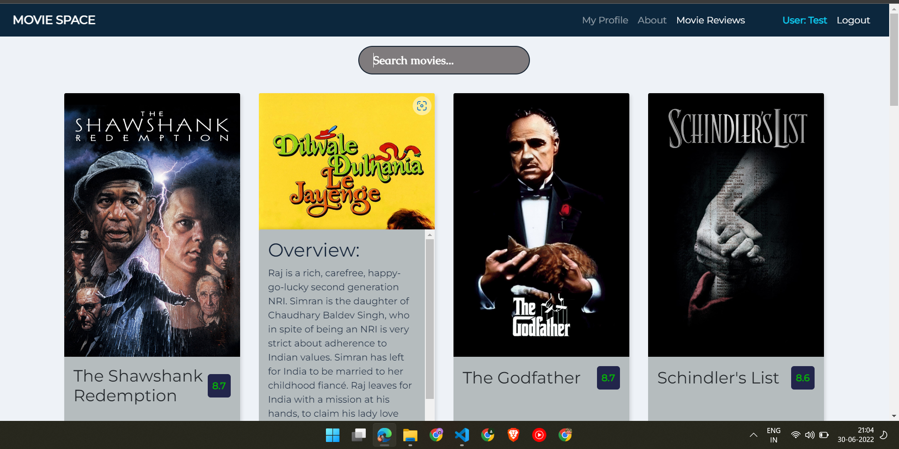

# Movie-Space-2.0
A movie hub based on MERN stack with Login and Registration of users with the help of MongoDb Atlas and JWT authorisation.

Website link: https://movie-space-2.herokuapp.com/
To run this app on your pc, create a .env file and add your own credentials of MongoDb atlas.

Screenshots of website:

 
 
 
 
 
 
 
